<div align="center">

# Magyar Scrabble

**Játssz magyar Scrabble-t a barátaiddal — a saját gépeden futó szerveren.**

*Hungarian Scrabble: self-hosted, online multiplayer, with robots, daily puzzles and a full Hungarian dictionary.*

Online többjátékos · 10 fokozatú robotok · napi feladvány · gyakorló módok · levelezős játék · ranglista · visszajátszás elemzéssel · admin panel

[**Gyors indítás**](#gyors-indítás) &nbsp;·&nbsp; [Telepítés lépésről lépésre](docs/INSTALL.md) &nbsp;·&nbsp; [Használati útmutató](docs/USER_GUIDE.md) &nbsp;·&nbsp; [Architektúra](docs/ARCHITECTURE.md)

<br>

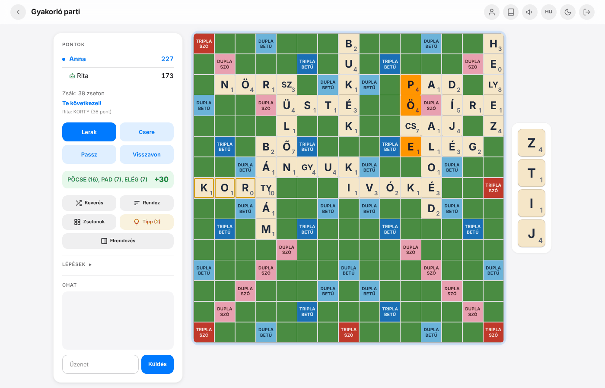

</div>

---

## Miért jó?

- **Egyetlen program, semmi más.** Egy Rust-ban írt futtatható fájl szolgálja ki a játékot, az adatbázist (SQLite) és a szótárt. Nincs adatbázis-szerver, nincs külső szolgáltatás, nincs
  előfizetés — üresjáratban ~70 MB memóriát használ, ezért otthoni szerverre (akár Raspberry Pi-re) is alkalmas.
- **Valódi magyar Scrabble.** 100 zseton, a kétjegyű betűk (SZ, CS, GY, LY, NY, TY, ZS) egy-egy zsetonon, a magyar szabályok szerint; beépített **hu_HU szótár** ragozott alakokkal, a
  gépiesen képzett, értelmetlen szavak kiszűrésével.
- **Gyorsan indul, könnyen megosztható.** Egy paranccsal publikus `https://…` címet kaphatsz (Cloudflare Tunnel), amit elküldhetsz a barátaidnak — regisztráció, port-megnyitás, domain nélkül.
- **Egyedül is játszható:** 10 nehézségi fokozatú robotok, vagy a **„Igazodik hozzám”** robot, ami az utolsó köreidhez állítja az erejét; tippek; napi feladvány; gyakorló módok.
- **Telefonon is kényelmes:** reszponzív felület, csípő-nagyítás, telepíthető alkalmazás (PWA), push értesítés, sötét téma, magyar és angol nyelv.

## Képek

<table>
<tr>
<td width="50%" valign="top">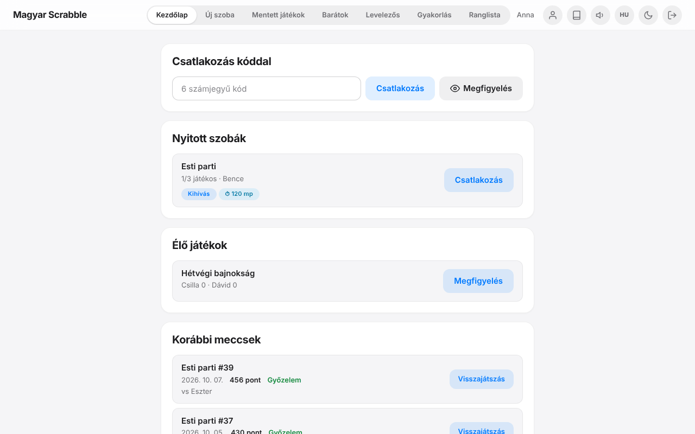<br><b>Lobby</b> — nyitott szobák, élő játékok (megfigyelhetők), korábbi meccsek</td>
<td width="50%" valign="top">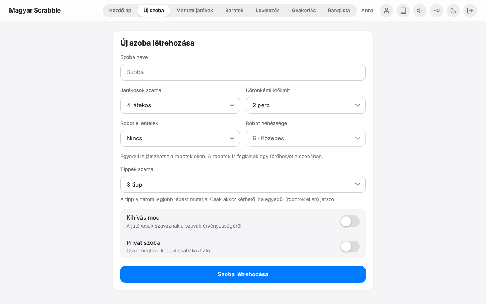<br><b>Új szoba</b> — robotok, időlimit, tippek, kihívás mód, privát szoba</td>
</tr>
<tr>
<td valign="top">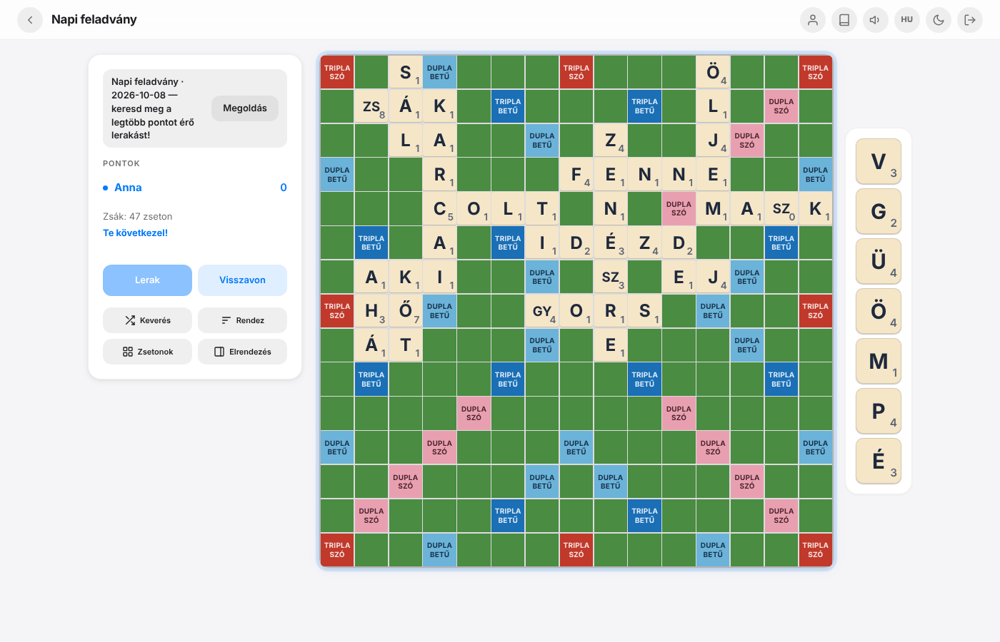<br><b>Napi feladvány</b> — mindenkinek ugyanaz a tábla és kéz: keresd meg a legjobb lépést</td>
<td valign="top">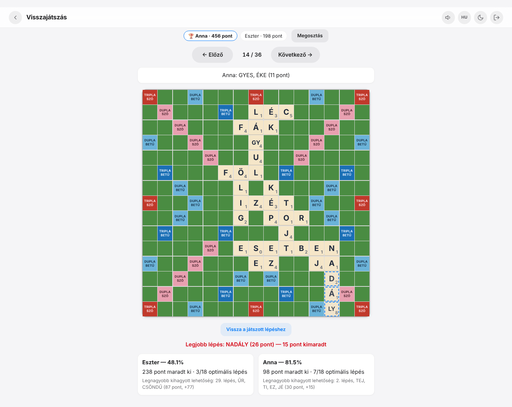<br><b>Visszajátszás és elemzés</b> — lépésenként a legjobb lehetséges lépés és a kint maradt pont</td>
</tr>
<tr>
<td valign="top">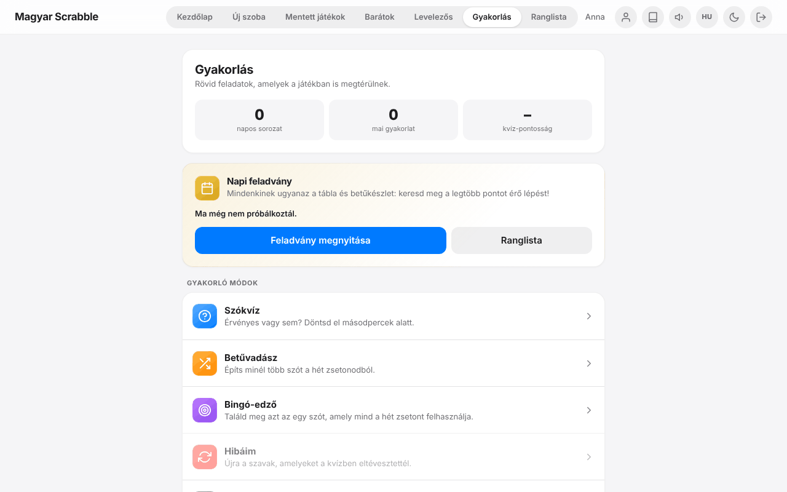<br><b>Gyakorlás</b> — szókvíz, betűvadász, bingó-edző, szólisták, szótár-építő</td>
<td valign="top">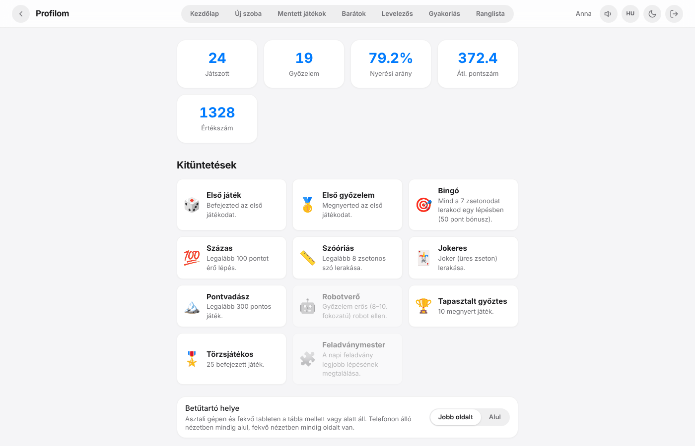<br><b>Profil</b> — statisztika, értékszám (ELO), kitüntetések</td>
</tr>
<tr>
<td valign="top">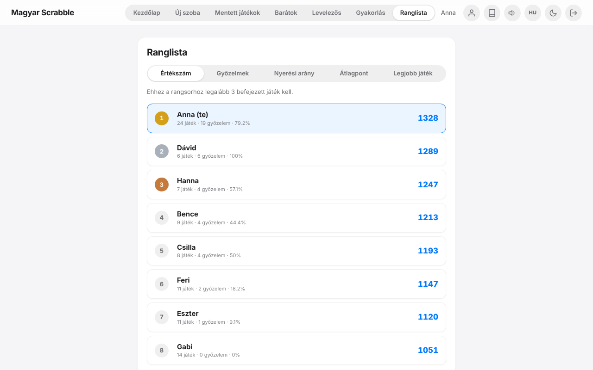<br><b>Ranglista</b> — értékszám, győzelmek, nyerési arány, átlagpont</td>
<td valign="top">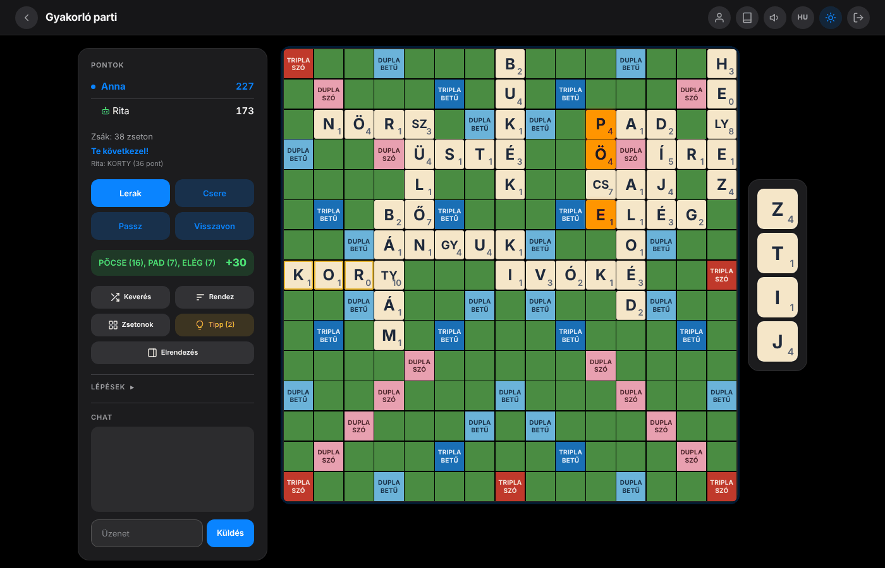<br><b>Sötét téma</b> — automatikus felismeréssel, kézzel is váltható</td>
</tr>
</table>

<p align="center">
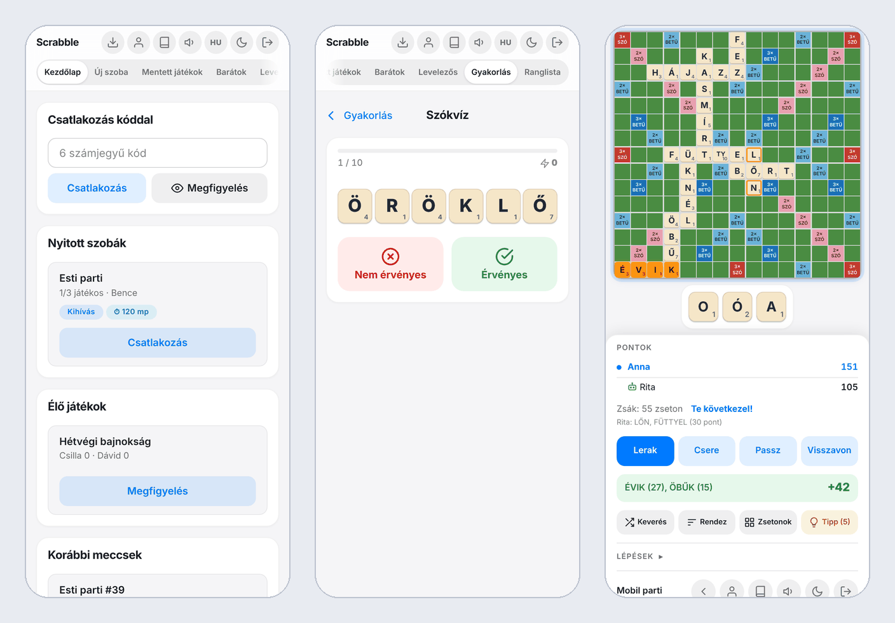<br>
<b>Telefonon</b> — ugyanaz a felület, álló és fekvő nézetben is
</p>

<details>
<summary><b>Több kép</b> — szókvíz, betűvadász, tipp, várakozó szoba, admin panel</summary>
<br>

<table>
<tr>
<td width="50%" valign="top">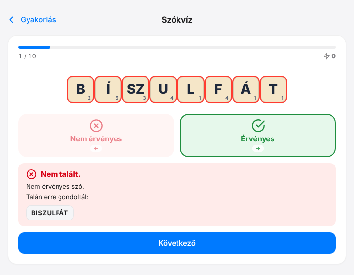<br>Szókvíz: „érvényes-e a szó?” — magyarázattal és javaslattal</td>
<td width="50%" valign="top">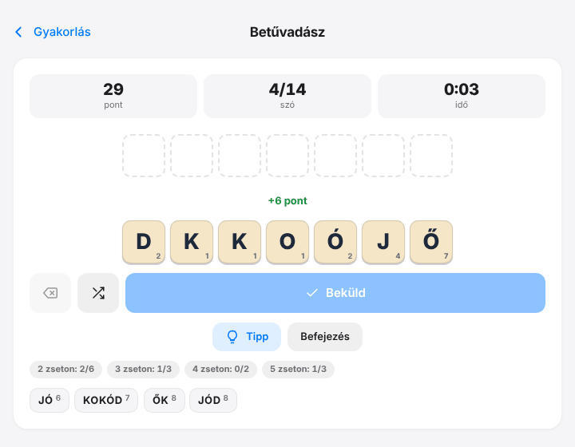<br>Betűvadász: hét zsetonból minél több szó</td>
</tr>
<tr>
<td valign="top">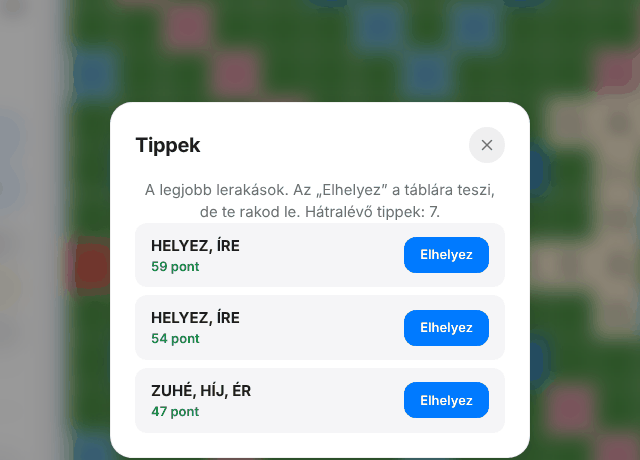<br>Tipp: a három legjobb lépés (egyedül, robot ellen)</td>
<td valign="top">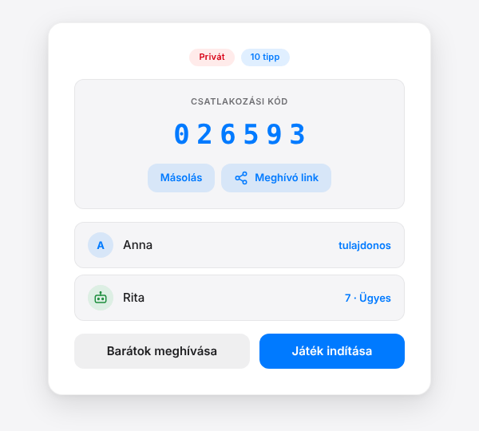<br>Várakozó szoba: kód, meghívó link, barátok meghívása</td>
</tr>
<tr>
<td valign="top">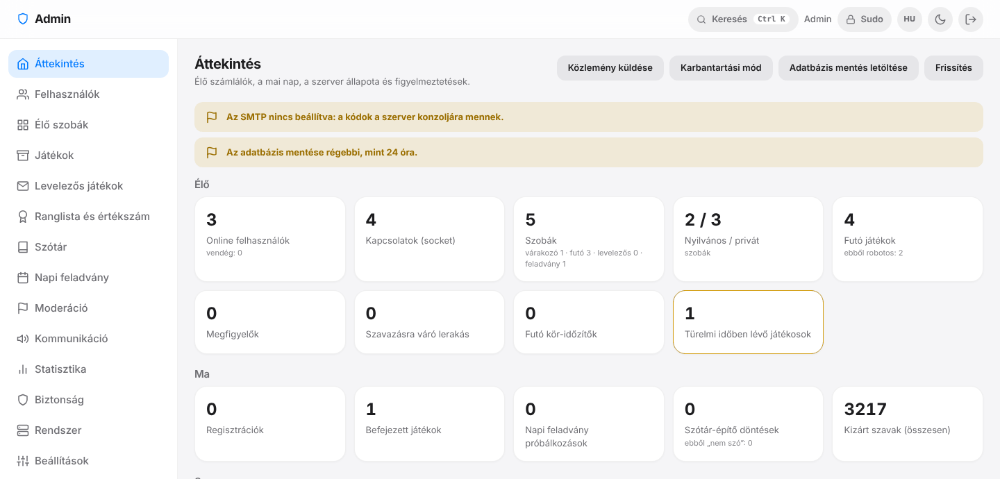<br>Admin panel: áttekintés (élő számlálók, figyelmeztetések)</td>
<td valign="top">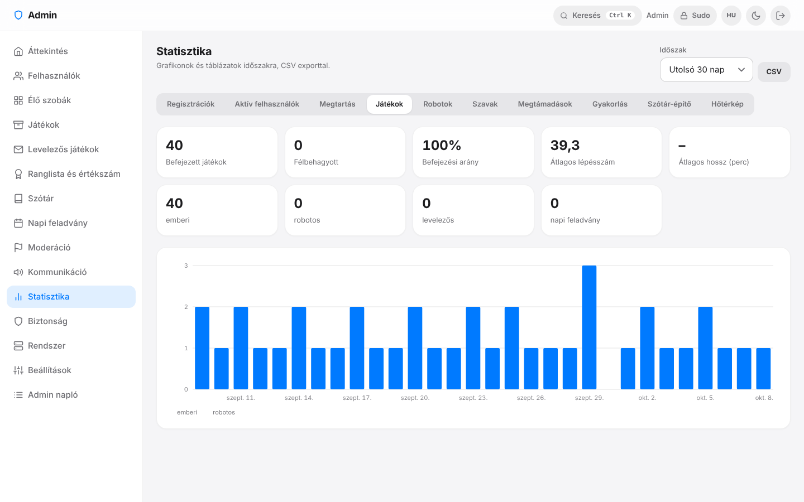<br>Admin panel: statisztika, grafikonok, CSV export</td>
</tr>
</table>

</details>

---

## Gyors indítás

> **Nincs még Rust a gépeden, vagy nem programozó vagy?** Semmi baj — a [Telepítési útmutató](docs/INSTALL.md) Windowsra, macOS-re, Linuxra és Raspberry Pi-re is végigvezet, parancsról parancsra.

Ha van **Rust 1.85+** és C fordító (lásd [lent](#mi-kell-hozzá)):

```bash
git clone https://github.com/pirelike/scrabble-magyar-ai.git
cd scrabble-magyar-ai
cargo build --release                    # egyszer; kb. 2–3 perc
scripts/run.sh --no-tunnel               # indítás (Windowson: target\release\scrabble.exe --no-tunnel)
```

Nyisd meg a böngészőben: **<http://localhost:5000>** — regisztrálj (SMTP nélkül a megerősítő kód magától kitöltődik, kitalált e-mail címmel is megy), és az **Új szoba** fülön indítsd az első játékod egy robot ellen.

| Mit szeretnél? | Parancs |
|---|---|
| Csak a saját gépemen / a lakás Wi-Fi-jén | `scripts/run.sh --no-tunnel` — a többiek a `http://<a gép IP-címe>:5000` címen érik el |
| Publikus link a barátoknak | `scripts/run.sh` — ha van `cloudflared`, a konzolon megjelenik a `https://….trycloudflare.com` cím ([részletek](docs/INSTALL.md#6-játék-az-interneten-át-cloudflare-tunnel)) |
| Másik port | `.env` fájlba: `PORT=8080` |

### Mi kell hozzá?

| Összetevő | Részletek |
|---|---|
| **Rust** (1.85 vagy újabb) | <https://rustup.rs> — a `cargo` parancs ezzel települ |
| **C fordító** | Linux: `sudo apt install build-essential` · macOS: `xcode-select --install` · Windows: *Visual Studio C++ Build Tools* |
| **Git** (vagy a GitHub „Download ZIP”-je) | a forrás letöltéséhez |
| Böngésző internettel | a Socket.IO kliens az első betöltéskor a `cdnjs`-ről jön, utána gyorsítótárazott |

Rendszercsomag (hunspell, OpenSSL, adatbázis-szerver) **nem** kell.

### Az első 5 perc

1. **Regisztráció** (*Regisztráció* fül): e-mail → kód → jelszó + név. *Vendégként* csak csatlakozni, nézni és gyakorolni lehet.
2. **Új szoba** → *Robot ellenfelek: 1* → **Szoba létrehozása** → **Játék indítása**.
3. Húzd a betűket a táblára (vagy koppints), nézd az **élő előnézetet**, majd **Lerak**. Elakadtál? **Tipp**.
4. Barátokkal: a várakozó szobában a **Meghívó link** gomb egy `…/?join=KÓD` hivatkozást másol — aki megnyitja, egy kattintással belép.

Részletesen: [Használati útmutató](docs/USER_GUIDE.md).

---

## Funkciók

**Játék**
- 1–4 játékos, **nyilvános és privát szobák** (6 jegyű kód / meghívó link), élő lobby, körönkénti időlimit (automatikus passz)
- Magyar zsetonkészlet és pontozás (DL / TL / DW / TW, 50 pontos bingó, joker), **kétjegyű betűk** a magyar szabályok szerint
- **Beágyazott hu_HU szótár** (tiszta Rust, rendszerfüggőség nélkül): ragozott alakok, a furcsa alakok szűrése, felhasználói szótár-építő
- **Kihívás mód**: szótár helyett a játékosok szavaznak (2 fő: elfogad / elutasít, 3–4 fő: megtámadás és szavazás)
- Élő pontszám-előnézet, zsetonszámláló, keverés / rendezés, gyorsbillentyűk, visszavonás, lépéstörténet
- **Újracsatlakozás**: kapcsolatszakadás után 2 percig megmarad a helyed; **mentés / folytatás** később

**Robotok és gyakorlás**
- **10 fokozatú robot** (újonc → mester) és **„Igazodik hozzám”**; tippek; robotos játék nem számít a ranglistába
- **Napi feladvány** (közös tábla, napi ranglista), **szókvíz** (hosszú–rövid csapdákkal), **betűvadász**, **bingó-edző**, szólisták, a tévesztett szavak paklija

**Közösség**
- **Barátlista**, szobameghívó, online jelző; **levelezős játék** barátokkal (24 órától 7 napig lépésenként, push értesítéssel)
- **Megfigyelő mód** (nyilvános játék nézése), chat, játékos / üzenet bejelentése
- **Ranglista** (ELO értékszám, győzelmek, nyerési arány, átlagpont, legjobb játék), profil, **kitüntetések**
- **Visszajátszás** lépésenként, **játékelemzés** (a legjobb lehetséges lépés és a kint maradt pont), megosztható link

**Üzemeltetés**
- **Admin panel** (`/admin`): felhasználók, élő szobák beavatkozásokkal, játékarchívum, szótár-kezelés, moderáció, közlemények és karbantartási mód, statisztika, biztonság, mentés, frissítés GitHubról — csak hozzáfűzhető, indoklással ellátott naplóval
- Egyetlen SQLite fájl (mentés = fájlmásolás), napi automatikus mentés, futásidejű beállítások újraindítás nélkül
- **Web Push**, **PWA**, magyar / angol felület, sötét / világos téma, Web Audio hangok (külső fájl nélkül)

---

## Hogyan kapcsolódjanak a barátok?

| Helyzet | Megoldás |
|---|---|
| Ugyanazon a Wi-Fi-n vagyunk | A szervert `--no-tunnel`-lel indítod; a barátok a `http://<IP-cím>:5000` címet nyitják meg (`ipconfig` / `hostname -I`). Windows tűzfal: engedélyezd a privát hálózatot. |
| Távol vagyunk | **Cloudflare Tunnel**: telepítsd a `cloudflared`-et, indítsd a szervert `--no-tunnel` nélkül, és küldd el a konzolon megjelenő `https://….trycloudflare.com` linket. Nem kell Cloudflare-fiók, domain, routerbeállítás. |
| Állandó cím, saját domain | Fordított proxy (Caddy / nginx) a program elé, vagy nevesített Cloudflare tunnel — [útmutató](docs/INSTALL.md#fordított-proxy-nginx--caddy). |

> **Windowson** a szerver az automatikus tunnel-indításhoz `cloudflared`-et keres a PATH-ban (`.exe` nélkül), ezért ott a tunnelt kézzel indítsd egy második ablakban:
> `cloudflared tunnel --url http://localhost:5000` (a szervert `--no-tunnel`-lel). Részletek: [INSTALL.md](docs/INSTALL.md#6-játék-az-interneten-át-cloudflare-tunnel).

---

## Beállítások

A gépre jellemző beállítások a program mappájában lévő **`.env`** fájlba kerülnek (`cp .env.example .env`; a fájl nincs a git tárban, ezért a frissítés nem írja felül). Minden beállítás **elhagyható**.

| Változó | Alapérték | Mire jó |
|---|---|---|
| `PORT` | `5000` | a szerver portja |
| `ADMIN_EMAILS` | *(üres: nincs admin panel)* | az admin panelhez kötött e-mail címek |
| `SMTP_HOST` · `SMTP_PORT` · `SMTP_USER` · `SMTP_PASSWORD` · `SMTP_FROM` | *(üres)* | valódi e-mail küldés a regisztrációs kódhoz (nélkülük a kód automatikusan kitöltődik) |
| `SCRABBLE_DB_PATH` · `SCRABBLE_BACKUP_DIR` | `scrabble.db` · `backups` | az adatbázis és a mentések helye (az indítás mappájától számítva) |
| `SCRABBLE_BASE_DIR` | *(a program mappája)* | ahol a `web/` és a `dict/` van, ha máshonnan indítod |

A teljes lista (SECRET_KEY, VAPID, admin időkorlátok, szótár-küszöb…) és a példák: [INSTALL.md — Beállítások](docs/INSTALL.md#7-beállítások-a-env-fájl).
Futásidőben az admin panel **Beállítások** oldalán további kapcsolók (regisztráció, robotok, funkciók, forgalomkorlátok, mentés) állíthatók újraindítás nélkül.

**Folyamatos futtatás** otthoni szerveren: kész `systemd` egység a [`deploy/scrabble.service`](deploy/scrabble.service) fájlban ([lépések](docs/INSTALL.md#8-folyamatos-futtatás-otthoni-szerver)).
**Mentés**: az adatbázis egyetlen fájl (`scrabble.db`); az admin panelről konzisztens mentés kérhető, és napi mentés is bekapcsolható. **Frissítés**: `git pull && cargo build --release`, majd újraindítás.

---

## Dokumentáció

| Dokumentum | Kinek? | Miről szól? |
|---|---|---|
| [**docs/INSTALL.md**](docs/INSTALL.md) | üzemeltetőnek, kezdőnek | telepítés Windowson / macOS-en / Linuxon / Raspberry Pi-n, tunnel, `.env`, systemd, mentés, hibaelhárítás |
| [**docs/USER_GUIDE.md**](docs/USER_GUIDE.md) | játékosnak | a játék használata: szabályok, robotok, gyakorlás, levelezős játék, ranglista, visszajátszás |
| [**docs/ARCHITECTURE.md**](docs/ARCHITECTURE.md) | fejlesztőnek | magas szintű felépítés: diagramok, modulok, egyidejűség, adatmodell, robot, szótár, biztonság |
| [docs/PROTOCOL.md](docs/PROTOCOL.md) | fejlesztőnek | az összes HTTP útvonal és Socket.IO esemény |
| [docs/ADMIN_PANEL.md](docs/ADMIN_PANEL.md) | fejlesztőnek | az admin panel részletes specifikációja |
| [docs/PERFORMANCE.md](docs/PERFORMANCE.md) | érdeklődőnek | mérések: a Python és a Rust változat összevetése |
| [docs/ENGINE_DUEL.md](docs/ENGINE_DUEL.md) | érdeklődőnek | a 10. fokozatú robot párharca egy független Scrabble motorral |
| [CLAUDE.md](CLAUDE.md) | fejlesztőnek, AI asszisztensnek | fejlesztői útmutató: konvenciók, tesztek, „hogyan bővítsd” |

---

## Röviden a felépítésről

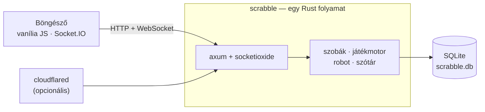

- **Szerver:** Rust (axum + socketioxide + tokio), SQLite (`rusqlite`, WAL), saját Hunspell-szerű szóellenőrző, saját Web Push és SMTP kliens — külső szolgáltatás nélkül.
- **Kliens:** vanília JavaScript (build lépés nélkül), Socket.IO, Web Audio, service worker; a `web/` mappa közvetlenül kiszolgálódik.
- **Protokoll-kompatibilis a régi Python (Flask) változattal:** ugyanazok a HTTP útvonalak és Socket.IO események, ugyanaz az SQLite séma — a meglévő `scrabble.db` változtatás nélkül folytatható; a Python változat a `python-final` ágon / címkén van.

| Mérés (4 mag, ugyanaz a mintaadatbázis) | Python | Rust |
|---|---|---|
| Memória üresjáratban | 164 MiB | 66 MiB |
| Teljes játékok (szoba + passzok + mentés) | 17,5 játék/mp | 101,5 játék/mp |
| Chat körülfordulás, p99 | 42,9 ms | 3,4 ms |
| Szó-ellenőrzés (8 szó) | 130 kérés/mp | 1432 kérés/mp |

A teljes táblázat és a módszer: [docs/PERFORMANCE.md](docs/PERFORMANCE.md). A 10. fokozatú robotot egy független külső Scrabble motorral is összemértük (tükrözött játékpárok, azonos szabályok és szótár):
[docs/ENGINE_DUEL.md](docs/ENGINE_DUEL.md).

<details>
<summary><b>Projektstruktúra</b></summary>

```
Cargo.toml, build.rs   — Rust projekt (szerver + karbantartó eszközök + mérés)
src/                   — a Rust forrás, témakörönként:
  engine/              —   játékszabályok: zsetonok, tábla, játékmenet, játékosok, megtámadás
  robot/               —   robot ellenfél (10 fokozat, „igazodik hozzám”), napi feladvány, játékelemzés
  words/               —   hu_HU szóellenőrző, szótár, gyakorló módok, szótár-építő
  accounts/            —   jelszó-hash, socket-token, értékszám (ELO), kitüntetések
  services/            —   levelezés (SMTP), Web Push, Cloudflare tunnel, forgalomkorlát
  db/                  —   SQLite réteg (séma: schema.sql)
  server/              —   HTTP útvonalak, Socket.IO események, szobák és szerverállapot, robotlépések
  admin/               —   admin panel (logika, őr, végpontok)
  bin/                 —   karbantartó eszközök (word_review, bot_arena, build_attested, engine_duel)
web/                   — static/ (nyilvános kliens), templates/ (index, admin, service worker), admin/ (admin kliens)
dict/                  — hu_HU szótár (hu_HU.aff / .dic), használati lista (hu_attested.txt), elutasított szavak (hu_rejected.txt)
tests/                 — integrációs tesztek, aranyfájlok (golden/), összevetés a régi szerverrel (compat/), böngészős próba (browser/)
scripts/, deploy/      — indító és mérő szkriptek, systemd egység
docs/                  — dokumentáció és képernyőképek
third_party/           — vendorolt külső Scrabble motor (csak a motor-összevetéshez)
```

</details>

<details>
<summary><b>Karbantartó eszközök</b></summary>

| Eszköz | Mire jó |
|---|---|
| `target/release/word_review` | a Szótár-építő tömeges párja: `sample` (véletlen szavak átnézésre), `apply` (elutasított szavak felvétele a `dict/hu_rejected.txt`-be), `stats` |
| `target/release/bot_arena` | a robot-fokozatok erejének mérése bot–bot játékokkal (`ladder`, `match`, `adapt`) |
| `target/release/build_attested` | a `dict/hu_attested.txt` előállítása szógyakorisági listából |
| `scripts/perf.sh` | teljesítményteszt a Python és a Rust verzió között |
| `target/release/engine_duel` | a robot párharca egy külső motorral (`cargo build --release --features engine-duel --bin engine_duel`) |

</details>

---

## Fejlesztés és tesztek

```bash
cargo run -- --no-tunnel              # fejlesztői indítás
cargo test                            # minden teszt (az első futás a fordítás miatt lassabb)
cargo test --test admin_users         # egy tesztfájl
cargo clippy --all-targets            # lint
```

Az integrációs tesztek **valódi szervert** indítanak véletlen porton, ideiglenes adatbázissal, és valódi HTTP / Socket.IO kliensekkel beszélnek vele (az e-mail és a Web Push is helyi „szolgáltatásra” megy).
A node-ot / Playwrightot igénylő tesztek ezek hiányában kimaradnak. A fejlesztői konvenciók, a tesztek áttekintése és a „hogyan bővítsd” útmutatók: [CLAUDE.md](CLAUDE.md).

## Hibaelhárítás

| Tünet | Megoldás |
|---|---|
| `linker cc not found` / `link.exe not found` a fordításkor | hiányzik a C fordító — lásd [Mi kell hozzá?](#mi-kell-hozzá) |
| `Address already in use` | foglalt a port: `.env` → `PORT=8080` |
| A telefonról nem érem el | ugyanazon a Wi-Fi-n vagy? `http://IP:5000` (nem `localhost`); tűzfal engedélyezése |
| Üres oldal, „Nincs kapcsolat a szerverrel” | a Socket.IO kliens a `cdnjs`-ről jön: kell internet (vagy engedélyezd a reklámblokkolóban) |
| `FIGYELEM: A szótár nem tölthető be` | hiányzik a `dict/` mappa — indítsd a repó mappájából, vagy add meg a `SCRABBLE_BASE_DIR`-t |
| Nem jön e-mail | SMTP nélkül nem is megy: a kód magától kitöltődik (admin címnél a konzolon olvasható) |

Több megoldás: [INSTALL.md — Hibaelhárítás](docs/INSTALL.md#11-hibaelhárítás-gyik).

## Köszönet és külső komponensek

- **Szótár**: a LibreOffice hu_HU szótára, amely Németh László és Godó Ferenc *Magyar Ispell* szólistáján és ragozási szabályain alapul (GPL / LGPL / MPL; lásd a `dict/hu_HU.aff` fejlécét).
- **Használati lista** (`dict/hu_attested.txt`): Hermit Dave [FrequencyWords](https://github.com/hermitdave/FrequencyWords) gyakorisági listájából (OpenSubtitles 2018, magyar), **CC BY-SA 4.0**.
- **Külső Scrabble motor** a párharchoz (`third_party/pg-scrabble`): Pranav Gundu [`scrabble`](https://github.com/pranavgundu/scrabble) csomagjának módosított másolata, **MIT** (lásd a `LICENSE` és `PATCHES.md` fájlokat).
- Rust könyvtárak: [axum](https://github.com/tokio-rs/axum), [socketioxide](https://github.com/Totodore/socketioxide), [tokio](https://tokio.rs), [rusqlite](https://github.com/rusqlite/rusqlite), [lettre](https://lettre.rs) és mások (lásd `Cargo.toml`).
- Socket.IO kliens: [socket.io](https://socket.io) (MIT), a `cdnjs`-ről töltve.
