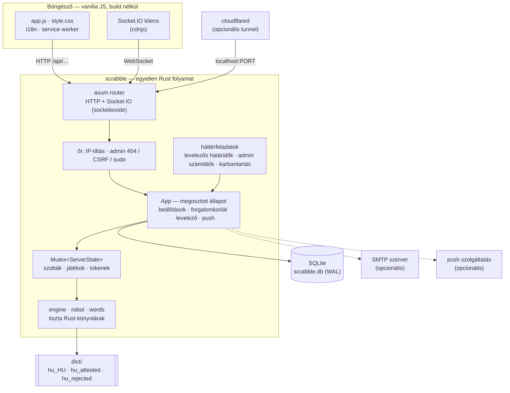
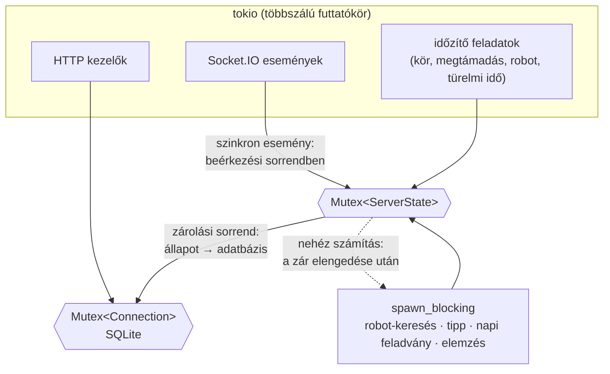
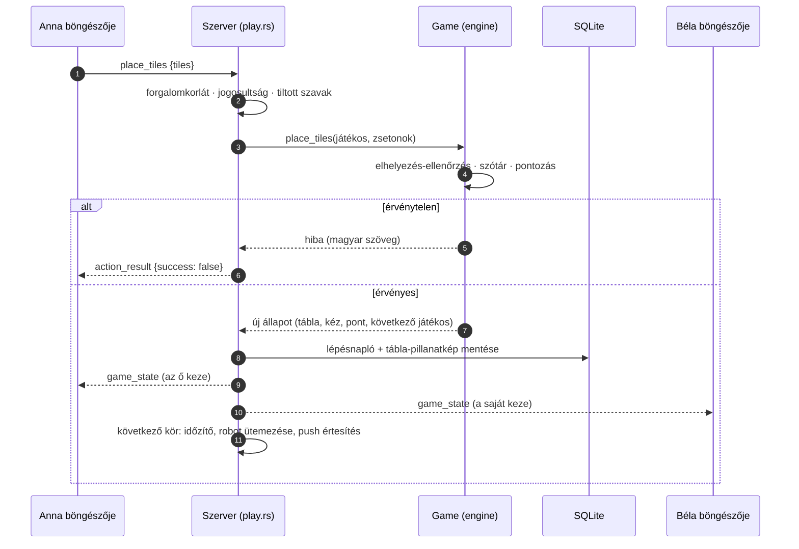

# Architektúra — magas szintű áttekintés

Ez a dokumentum azt mutatja meg, **hogyan áll össze** a Magyar Scrabble: milyen részekből áll, mi hol fut, hogyan
kerül egy lerakott betű a böngészőből az ellenfél képernyőjére, és mi marad meg az adatbázisban. Aki csak üzemeltetni
szeretné a programot, annak a [telepítési útmutató](INSTALL.md) elég; aki fejleszteni akarja, itt kezdje, majd
folytassa a [CLAUDE.md](../CLAUDE.md)-vel (konvenciók, tesztek, „hogyan bővítsd”) és a [protokoll-leírással](PROTOCOL.md).

- [1. A rendszer egy oldalon](#1-a-rendszer-egy-oldalon)
- [2. Alapelvek és miért így](#2-alapelvek-és-miért-így)
- [3. Folyamat és indulás](#3-folyamat-és-indulás)
- [4. Egyidejűség: zárak, sorrend, időzítők](#4-egyidejűség-zárak-sorrend-időzítők)
- [5. Egy lépés útja a böngészőtől a böngészőig](#5-egy-lépés-útja-a-böngészőtől-a-böngészőig)
- [6. Modulok](#6-modulok)
- [7. Adatmodell és tartósság](#7-adatmodell-és-tartósság)
- [8. A játékmotor](#8-a-játékmotor)
- [9. Szótár és szókincs](#9-szótár-és-szókincs)
- [10. A robot](#10-a-robot)
- [11. Valós idejű réteg: szobák, újracsatlakozás, megfigyelők](#11-valós-idejű-réteg-szobák-újracsatlakozás-megfigyelők)
- [12. Fiókok és biztonság](#12-fiókok-és-biztonság)
- [13. Az admin panel](#13-az-admin-panel)
- [14. A kliens](#14-a-kliens)
- [15. Üzemeltetés](#15-üzemeltetés)
- [16. Tesztelési stratégia](#16-tesztelési-stratégia)

---

## 1. A rendszer egy oldalon

Röviden:

- **Egyetlen futtatható fájl** (`target/release/scrabble`) szolgálja ki a statikus kliensfájlokat, a JSON API-t és a
  Socket.IO kapcsolatot ugyanazon a porton. Nincs külön adatbázis-szerver, üzenetsor vagy gyorsítótár-szolgáltatás.
- **A játékok memóriában élnek**, és a fontos pontokon (indulás, lépések, befejezés, kilépés) az SQLite-ba kerülnek;
  a levelezős játék otthona maga az adatbázis.
- **A játékszabályok, a robot és a szóellenőrző tiszta Rust könyvtárkód**, amely a hálózattól függetlenül tesztelhető
  (és tesztelt: valódi Hunspell-szerű szótár, aranyfájlok, külső motorral való összevetés).
- **A kliens statikus fájlokból áll** (nincs csomagkezelő, nincs fordítási lépés): ami a `web/` mappában van, azt kapja
  a böngésző.

## 2. Alapelvek és miért így

| Döntés | Indok |
|---|---|
| Egy folyamat, egy fájl az adatoknak | Otthoni szerverre készült: egy `cargo build`, egy `scrabble.db`. Mentés = fájlmásolás. |
| SQLite WAL módban, egyetlen zárolt kapcsolat | Kis terhelésnél egyszerű és gyors; az olvasók nem akadályozzák az írót; nincs kapcsolatkészlet-hangolás. |
| Szerver-oldali igazság | A tábla, a kéz, a pontozás és a szavak ellenőrzése mind a szerveren történik; a kliens csak megjelenít és javasol (előnézet, tipp). |
| Tiszta Rust szóellenőrző | Nincs rendszercsomag-függőség (enchant, hunspell): ugyanúgy fut Windowson, Linuxon és Raspberry Pi-n. |
| Vanília JS, DOM API | Nincs build lépés, nincs `innerHTML` (XSS ellen): a kliens fájlok közvetlenül szerkeszthetők. |
| Protokoll-kompatibilitás a régi Python változattal | A meglévő `scrabble.db` és a kliens változtatás nélkül folytatható; aranyfájlok őrzik az egyezést. |
| Minden szerver-szöveg magyar, a kliens fordít | A szerver üzenetei magyarul készülnek, a kliens `tServer()` fordítja angolra (a tesztek számon kérik a lefedettséget). |

## 3. Folyamat és indulás

A `src/main.rs` indulási sorrendje:

1. **Konfiguráció**: a program mappájában lévő `.env` fájl beolvasása (a ténylegesen beállított környezeti változó
   erősebb), majd a környezeti változók (`src/config.rs`). Hibás `ADMIN_IP_ALLOWLIST`-nél a program el sem indul.
2. **Adatbázis** megnyitása, séma és migrációk (`Db::init`: `CREATE TABLE IF NOT EXISTS` + `ensure_column`).
3. **`App`** felépítése (konfiguráció, adatbázis, futásidejű beállítások, forgalomkorlát, levelező, push, tunnel).
4. Szótár betöltése (`dictionary::warm_up`), futásidejű beállítások alkalmazása (a szótár-építőn kizárt szavak is),
   a robot szókincsének és a gyakorló módok listáinak előépítése, a mai napi feladvány előállítása.
5. Levelezős játékok visszaállítása az adatbázisból.
6. Háttérfeladatok indítása, opcionálisan a Cloudflare tunnel, majd a HTTP szerver (`0.0.0.0:PORT`).

Az indulás néhány másodperc (a szótár és a szókincs felépítése miatt); az első kérésnél már minden kész. Leállítás:
`Ctrl+C` vagy `SIGTERM` (kíméletes leállás).

## 4. Egyidejűség: zárak, sorrend, időzítők

- **Egyetlen állapotzár.** A szobák, játékosok, tokenek, megfigyelők és meghívók a `ServerState`-ben vannak, az `App`
  `Mutex`-e mögött. A szinkron Socket.IO események kezelője a zárolt állapoton dolgozik, így egy esemény hatása
  oszthatatlan. **Zárolási sorrend: állapot → adatbázis** (fordítva soha, különben holtpont).
- **Sorrendhelyes feldolgozás.** A `socketioxide` minden kezelőt külön feladatként indít, ami nem garantál sorrendet;
  az `InOrder` kinyerő viszont a beérkezés pillanatában, sorban lefuttatja az eseményt. Így egy kapcsolat két gyors
  üzenete (lerakás és passz, két chat) mindig a küldés sorrendjében hat. A `SYNC_EVENTS` táblázat (`server/mod.rs`) sorolja
  fel a szinkron eseményeket; a hosszabbak (`request_hint`, `start_daily`) aszinkron kezelők.
- **Hibatűrés.** Egy kezelő pánikja (`catch_unwind`) nem ejti el a kapcsolat olvasását; a szerver üzenetet ír a
  konzolra és megy tovább.
- **Nehéz számítás kívül.** A robot lépéskeresése, a tipp, a napi feladvány előállítása és a játékelemzés a blokkoló
  szálkészleten (`spawn_blocking`) fut. A számítás alatt az állapot változhat, ezért a lépés előtt a szerver újra
  ellenőriz (pl. ugyanaz-e még a kör).
- **Időzítők érvénytelenítéssel.** A körtimer, a megtámadási ablak és a robotlépés tokio-feladat; a szoba számlálói
  (`turn_timer_id`, `challenge_timer_id`, `bot_turn_id`) minden új ütemezésnél nőnek, így a régi feladat lejártakor
  észreveszi, hogy elavult, és nem tesz semmit. Ugyanez a minta védi a türelmi időket (lecsatlakozási sorszám).
- **Háttérfeladatok** (`spawn_background_tasks`): percenként a levelezős határidők, 5 másodpercenként az admin
  számlálók (csak ha nézi valaki), óránként a napi mentés és a régi chat napló törlése.

## 5. Egy lépés útja a böngészőtől a böngészőig

Megtámadás (kihívás) módban a szótár helyett a játékosok döntenek: a lerakás szavazásra vár (`challenge.rs`
állapotgép, 30 mp), az eredményt a `challenge_result` esemény hozza. Robot lépésekor a `schedule_bot_turn` ütemezi a
következő robotkört, `play_bot_turn` pedig a blokkoló szálon megkeresi és lejátssza a lépést.

## 6. Modulok

| Mappa / fájl | Felelősség |
|---|---|
| `src/main.rs`, `lib.rs` | indulás; modulok és lapos újraexportok (`crate::tiles` = `crate::engine::tiles`) |
| `src/app.rs`, `config.rs`, `settings.rs`, `util.rs` | megosztott állapot; konfiguráció és `.env`; futásidejű beállítások (`app_settings`); apróságok |
| `src/engine/` | **játékszabályok**: `tiles` (100 zseton, kétjegyű betűk), `board` (15×15, premium mezők, ellenőrzés, pontozás), `game` (körök, vég, szavazás, napi feladvány, levelezős mód), `player`, `challenge` |
| `src/robot/` | `ai` (lépéskeresés, fokozatok, tipp), `analysis` (játékelemzés), `daily` (napi feladvány) |
| `src/words/` | `affix` (Hunspell-szerű ellenőrző), `dictionary` (szótár-API, gyorsítótár), `practice` (gyakorló módok), `word_review` (szótár-építő) |
| `src/accounts/` | jelszó-hash (PBKDF2), socket-token, értékszám (ELO), kitüntetések |
| `src/services/` | `mail` (SMTP), `push` (Web Push), `ratelimit`, `tunnel` (cloudflared) |
| `src/db/` | SQLite réteg: `schema.sql`, `users`, `games`, `misc` |
| `src/server/` | `mod` (útvonalak, Socket.IO bekötés), `http`, `events` (lobby, szobák), `play` (játékmenet), `extras` (napi, levelezős, barátok, megfigyelők), `core` (robotlépések, mentés, időzítők), `room`, `state`, `net` |
| `src/admin/` | az admin panel logikája, őre és végpontjai (`routes`, `api/*`) |
| `src/engine_duel/` | a robot és egy külső motor párharca (csak `--features engine-duel`) |
| `src/bin/` | karbantartó eszközök: `bot_arena`, `word_review`, `build_attested`, `engine_duel` |
| `web/` | `static/` (nyilvános kliens), `templates/` (index, admin, service worker), `admin/` (admin kliens, csak az őrzött útvonalon) |
| `dict/` | szótárfájlok, használati lista, elutasított szavak |
| `third_party/pg-scrabble/` | vendorolt külső Scrabble motor (csak a párharchoz) |

## 7. Adatmodell és tartósság

A teljes séma a `src/db/schema.sql`-ben van (a Python változattal azonos; a migrációkat a `Db::init` futtatja).

| Csoport | Táblák |
|---|---|
| Fiókok és belépés | `users`, `sessions`, `verification_codes`, `verified_emails`, `login_events`, `ip_bans` |
| Játékok | `saved_games` (állapot JSON), `game_players`, `game_moves` (lépésnapló + tábla-pillanatkép), `game_analysis` (gyorsítótár) |
| Közösség | `friendships`, `achievements`, `push_subscriptions` |
| Napi feladvány, gyakorlás | `daily_puzzles`, `daily_scores`, `usage_counters` (a gyakorló módok napi hívásszáma) |
| Szótár | `word_reviews` (szótár-építő szavazatok), `word_overrides` (admin: szó tiltása / engedélyezése), `word_additions` (admin: saját szavak) |
| Moderáció és kommunikáció | `reports`, `banned_words`, `chat_log`, `announcements`, `user_admin_notes` |
| Admin | `admin_audit` (csak hozzáfűzhető: triggerek tiltják a módosítást és a törlést), `rating_adjustments`, `app_settings` |

**Mikor kerül adat a lemezre?**

- A játék **indulásakor** a teljes játékoslista mentődik (roster); ezután **minden lerakás / csere után** a lépésnapló
  is (a kéz a lépés előtt, a tábla pillanatképe), a **befejezéskor** a végeredmény (statisztika, értékszám,
  kitüntetések). Manuális mentés a tulajdonosnak a kilépés menüből; ha a tulajdonos véglegesen lecsatlakozik, a szerver
  automatikusan ment a szoba feloszlatása előtt.
- A **levelezős játék** otthona az adatbázis: minden változás után mentődik, és induláskor a szerver visszaállítja.
- A **napi feladvány** és az egyjátékos feladványos szoba nem kerül az előzményekbe; az eredmény külön rögzül.
- A **Python-kompatibilitás** miatt a `saved_games.state_json` formátuma változatlan; a robot és a kitüntetések a
  lépésnaplóból számolnak, ezért a naplóformátumot (kéz, pontszám, szavak) érdemes megőrizni.

## 8. A játékmotor

- **Zsetonok** (`tiles.rs`): a magyar 100 zsetonos készlet (2 joker), 38 betű; a kétjegyű betűk (SZ, CS, GY, LY, NY,
  TY, ZS) egy-egy zseton. `tokenize_word` szóból zsetonsort csinál (kevesebb zseton, döntetlennél több pont), a
  `forms_digraph` pedig kimondja, ha két külön zseton hamis kétjegyű betűt adna (S + Z) — ez nem megengedett, de a régi,
  megengedőbb szabállyal indult állások folytathatók (csak az új zsetont érintő párokat nézi a szerver).
- **Tábla** (`board.rs`): elhelyezés-ellenőrzés (egy sor / oszlop, folytonosság, csatlakozás, a közép lefedése),
  keresztszavak, premium mezők, szótár-ellenőrzés (megtámadás módban és robotnál kihagyva), 50 pont bingó.
- **Játék** (`game.rs`): körök, csere, passz, a játék vége (üres kéz + üres zsák, vagy 6 egymást követő pont nélküli
  kör), döntetlen = több győztes, kör időlimit, visszavonás, robotok, napi feladvány, levelezős mód (határidő, lejárat,
  feladás). A `to_save_dict` / `from_save_dict` a mentés formátuma.
- **Megtámadás** (`challenge.rs`): 2 játékosnál a másik fél elfogad / elutasít, 3+ játékosnál szavazás (a lerakó és a
  megtámadó nem szavaz; ≥ 50% elfogadás → marad; a nem szavazó elfogadónak számít). A robotok nem szavaznak.

## 9. Szótár és szókincs

A játék szótára a `hu_HU` Hunspell szótár (`dict/hu_HU.aff` + `.dic`), de **a program saját, tiszta Rust
megvalósítással** olvassa (`words/affix.rs`): szótő, előtag, legfeljebb két toldalék, folytonossági osztályok,
`NEEDAFFIX` / `ONLYINCOMPOUND` / `FORBIDDENWORD` — **összetételi szabályok nélkül**, így értelmetlen összetételek
(PAGONYAGY) nem érvényesek.

A helyesírás-ellenőrző szótár minden nyelvtanilag lehetséges alakot elfogad, a Scrabble-hoz viszont ez túl sok. Három
szűrőréteg tisztítja:

1. **Morfológiai címkék** (`AM` aliasok): a csak kötőjellel toldalékolható szócikkek (rövidítések, idegen írásmód)
   érvénytelenek; a *kockázatos levezetések* (melléknév + birtokos személyjel, `-ék`, `-ul/-ül` főnéven, `-né`) csak akkor
   érvényesek, ha szerepelnek a `dict/hu_attested.txt` listán (ténylegesen használt alakok, [FrequencyWords](https://github.com/hermitdave/FrequencyWords),
   CC BY-SA 4.0).
2. **Elutasított szavak** (`dict/hu_rejected.txt`, több mint háromezer alak): a szótár-építő átnézésén „nem rendes szó”-nak
   ítélt, gépiesen képzett vagy torz alakok. A felhasználók a **Szótár-építőben** is szavazhatnak (`word_reviews`); a
   küszöböt (`WORD_REJECT_THRESHOLD`) elérő szó azonnal kizárul.
3. **Admin felülbírálatok** (`word_overrides`, `word_additions`): az admin panelről szó tiltása vagy engedélyezése.

A **robot szókincse** (`robot/ai.rs`) a szótár tőszavai (kisbetűs, magánhangzót tartalmazó, zsetonokra bontható,
2–15 betű) **és** gyakori ragozott alakok (szótő + egy végződés a szótár saját szabályaival, legfeljebb 6 betűs tőre és
12 betűs alakra, kockázatos levezetések nélkül); rendezett listában, bináris kereséssel. Az első kérésig felépül.

## 10. A robot

- **Lépésgenerálás**: Appel–Jacobson horgonykeresés vízszintesen és (átfordított rácson) függőlegesen; a kétjegyű
  zsetonok több karaktert lépnek; a joker bármely betű. A keresztszavakat **egyetlen** `filter_valid` hívás
  ellenőrzi az egész táblára; a pontozás a játék saját `Board`-jával történik egy privát másolaton, így a robot sosem
  tér el a szabályoktól.
- **10 fokozat** + „Igazodik hozzám”: az erőt a **lépéskiválasztás** szabja meg, nem a szókincs. Az 1–7. fokozat
  célpontszámot sorsol és a hozzá legközelebbi lépést rakja le; a 8–10. a pont + a kézben maradó zsetonok értéke
  szerint értékel (egyre kisebb zajjal). A mért erősség (pont/kör): 4,3 · 6,1 · 7,4 · 10,1 · 12,7 · 15,7 · 18,4 · 21,2 ·
  24,6 · 27,0. Az „igazodó” robot az ember utolsó 6 körének átlagát képezi le fokozatra.
- **Tipp** (a három legjobb lépés), **elemzés** (`analysis.rs`: lépésenként a legjobb lépés és a kint maradt pont,
  a `game_analysis` táblában gyorsítótárazva) és **napi feladvány** (`daily.rs`: a dátumból determinisztikusan indított
  bot–bot játék néhány lépés után) ugyanazt a motort használja.
- **Mérés és kalibráció**: `bot_arena` (fokozatok egymás ellen), és a külső motorral való párharc
  ([ENGINE_DUEL.md](ENGINE_DUEL.md)).

## 11. Valós idejű réteg: szobák, újracsatlakozás, megfigyelők

- **Azonosság**: a kapcsolat (SID) a `set_name` eseménnyel mutatkozik be. Regisztrált felhasználónál a `/api/auth/socket-token`
  által adott, aláírt, 5 percig érvényes token kötelező; vendégként csak név.
- **Szoba**: játék + tulajdonos + beállítások + chat (legfeljebb 100 üzenet) + megfigyelők; hat számjegyű csatlakozási kód;
  nyilvános szobák a lobbyban, privát csak kóddal.
- **Személyre szabott állapot**: minden játékos a saját kezét látja (`game_state`), a megfigyelő kéz nélküli
  állapotot kap (`spectator: true`).
- **Újracsatlakozás**: a lecsatlakozott játékos nem törlődik, csak `disconnected` lesz; a játék átugorja. 120 mp
  türelmi idő (a várakozó szoba tulajdonosának 10 perc) a tokennel való visszatérésre (`rejoin_room`); a türelmi idők
  sorszámot kapnak, így egy régi lejárat nem zárja le egy újabb lecsatlakozás idejét.
- **Megfigyelők**: szobánként alapértelmezetten legfeljebb 30 (admin beállítás: `max_spectators`); belépnek a Socket.IO szobába, de nem játékosok.
- **Levelezős játék**: tartós, privát szoba; a lecsatlakozás csak a nézetet zárja be; a határidőt a percenkénti
  háttérfeladat figyeli.

A részletes esemény- és útvonallistát a [PROTOCOL.md](PROTOCOL.md) tartalmazza.

## 12. Fiókok és biztonság

- **Jelszó**: PBKDF2-SHA256, 260 000 iteráció, véletlen só, a werkzeug formátumával kompatibilisen (`pbkdf2:sha256:260000$…`).
- **Munkamenet**: véletlen token `HttpOnly`, `SameSite=Lax`, `Secure` sütiben, 30 nap; kitiltott / törölt felhasználóra azonnal érvénytelen.
- **Regisztráció**: e-mail → 6 számjegyű kód (10 perc, legfeljebb 5 próba) → jelszó + név. SMTP nélkül a kód a
  konzolra íródik, és a kliens automatikusan kitölti („fejlesztői mód”) — kivéve az admin címeket, azoknak a kódja
  csak a konzolon látszik.
- **Forgalomkorlát**: minden Socket.IO eseményre SID szerint, a HTTP auth / API végpontokra IP szerint
  (`services/ratelimit.rs`); az értékek az admin panelen futásidőben felülírhatók. A kliens IP-jét a proxy fejlécekből
  (`CF-Connecting-IP`, `X-Forwarded-For`) csak helyi (loopback) proxy esetén fogadja el a szerver.
- **Bemenetek**: nevek, szobanevek, pozíciók, e-mail, jelszó szerver oldali ellenőrzése; a szótár-lekérdezés
  regex-szel szűrt; a kliens DOM API-t használ (`textContent`, `createElement`), `innerHTML` nincs.
- **CORS**: minden origin engedélyezett (a Cloudflare tunnelhez szükséges); a védelem a munkamenet és a forgalomkorlát.

## 13. Az admin panel

Az admin panel (`/admin`) **láthatatlan a nem admin számára**: az őr (`admin/routes.rs`) az egész alkalmazás elé kerül,
az útvonal-illesztés előtt, ezért a rossz metódus, a nem létező alútvonal és a `//admin` is ugyanazt a szokásos 404-et
adja. Az admin címeket az `ADMIN_EMAILS` határozza meg (nem adatbázis-oszlop).

Az őr lépései: azonosítás → IP-engedélylista → forgalomkorlát → CSRF (`X-Admin-Request` fejléc + azonos eredet) →
tétlenségi időkorlát (újraigazolás). A romboló műveletekhez **sudo mód** kell (friss jelszó, időkorlátos). Minden
módosítás **kötelező indoklással**, a művelettel egy tranzakcióban kerül a csak hozzáfűzhető `admin_audit` naplóba.
A részletes specifikáció: [ADMIN_PANEL.md](ADMIN_PANEL.md).

## 14. A kliens

- **Fájlok**: `web/templates/index.html` (egyoldalas felület: belépés, lobby, várakozó szoba, játék, profil,
  visszajátszás), `web/static/app.js` (modulok: `Auth`, `Lobby`, `WaitingRoom`, `GameBoard`, `Hint`, `Chat`,
  `Daily`, `Practice`, `WordBuilder`, `AsyncGames`, `Friends`, `Profile`, `Replay`, `Leaderboard`,
  `SoundManager`, `Push`, `PWA`…), `style.css` (tokenek, sötét / világos téma), `i18n.js` + `i18n-data.js`.
- **Elrendezések**: asztali gép (oldalpanel + tábla + betűtartó jobbra vagy alul), álló telefon / tablet (tábla fent,
  görgethető panel alul), fekvő telefon. A tábla méretét a CSS számolja a viewportból; a panel soha nem takarja el a
  táblát.
- **Többnyelvűség**: `data-i18n*` attribútumok és `t()`; a szerver magyar üzeneteit `tServer()` fordítja. Új szöveghez
  kulcs kell a hu **és** en blokkba, különben a tesztek elbuknak.
- **PWA**: manifest, service worker (váz előtöltése, navigáció hálózat-először, a `/socket.io/` és `/api/` soha nem
  gyorsítótárazott), telepítés gomb. A Socket.IO kliens a cdnjs-ről töltődik (a service worker gyorsítótárazza), ezért
  az első betöltéshez a böngészőnek internet kell.
- **Hang**: Web Audio API-val szintetizált hangok, külső fájl nélkül.

## 15. Üzemeltetés

- **Beállítás**: `.env` a program mappájában + környezeti változók; futásidőben az admin panel Beállítások oldala
  (`app_settings`, újraindítás nélkül hat).
- **Adatok**: `scrabble.db` (+ `-wal`, `-shm`), mentések a `backups/` mappában (admin panel: kérésre és napi
  ütemezéssel).
- **Frissítés**: `git pull && cargo build --release` + újraindítás, vagy az admin panelről (fast-forward, szükség
  esetén újrafordítás, hiba esetén visszagörgetés; Unixon).
- **Naplók**: a konzol kimenetét a szerver gyűjti, az admin panel Rendszer → Naplók nézete mutatja.
- **Tunnel**: a `cloudflared` gyermekfolyamatot a szerver indítja és állítja le; a publikus cím a konzolra íródik.

## 16. Tesztelési stratégia

- **Integrációs tesztek valódi szerverrel**: a `TestServer` véletlen porton, ideiglenes adatbázissal indít egy teljes
  szervert; a tesztek valódi HTTP (`ureq`) és Socket.IO (`tokio-tungstenite`) klienssel beszélnek vele. Az e-mail és a
  push helyi „szolgáltatásra” megy (hamis SMTP kiszolgáló, visszafejtéssel ellenőrzött push).
- **Aranyfájlok** (`tests/golden/`): a régi Python változattal előállított adatok (szóellenőrzés, robotlépések,
  gyakorló módok, szókincs, játékállapotok, SQLite fájl) — a Rust változat viselkedésének egyezését őrzik.
- **Differenciális összevetés** (`tests/compat/`): ugyanazok a forgatókönyvek a régi és az új szerveren.
- **Kliens-tesztek node-ban** (fordítások teljessége, kliens ↔ szerver összhang, gyakorló logika) és **böngészős
  füstpróba** Playwright-tal (kimarad, ha nincs node / Chromium).
- **Párharc** (`engine-duel`): a robot és egy független motor játékvezetővel, tükrözött párokkal
  ([ENGINE_DUEL.md](ENGINE_DUEL.md)).

A futtatás és a konvenciók a [CLAUDE.md](../CLAUDE.md)-ben vannak.
