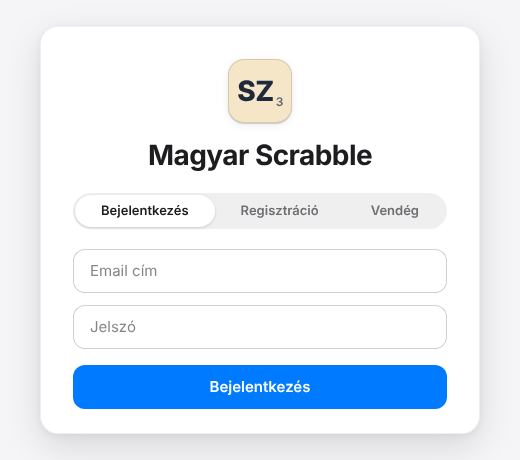
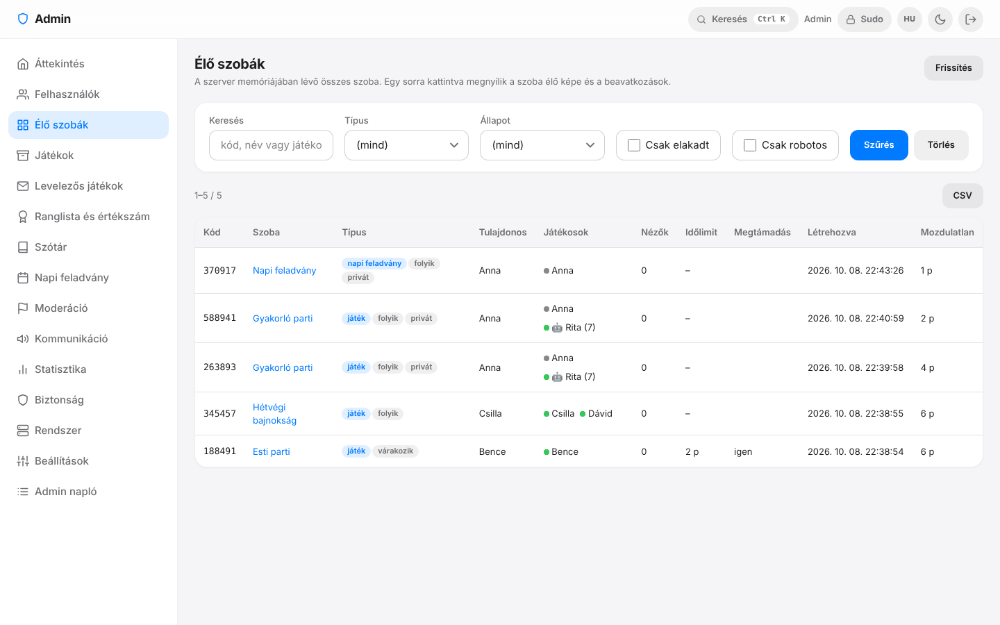

# Telepítési útmutató — lépésről lépésre, kezdőknek

Ez az útmutató feltételezi, hogy **még soha nem fordítottál le programot**. Végigvezet azon, hogyan lesz a saját
gépedből (laptop, otthoni szerver, Raspberry Pi) Scrabble-szerver, amihez a családod és a barátaid csatlakozhatnak.

> **Tartalom**
> 1. [Mi kell hozzá?](#1-mi-kell-hozzá)
> 2. [Előkészületek: Rust és C fordító](#2-előkészületek-rust-és-c-fordító) — Windows · macOS · Linux · Raspberry Pi
> 3. [A program letöltése és lefordítása](#3-a-program-letöltése-és-lefordítása)
> 4. [Első indítás és regisztráció](#4-első-indítás-és-regisztráció)
> 5. [Játék a lakásban (ugyanazon a Wi-Fi-n)](#5-játék-a-lakásban-ugyanazon-a-wi-fi-n)
> 6. [Játék az interneten át (Cloudflare Tunnel)](#6-játék-az-interneten-át-cloudflare-tunnel)
> 7. [Beállítások: a `.env` fájl](#7-beállítások-a-env-fájl)
> 8. [Folyamatos futtatás (otthoni szerver)](#8-folyamatos-futtatás-otthoni-szerver)
> 9. [Admin panel bekapcsolása](#9-admin-panel-bekapcsolása)
> 10. [Mentés, frissítés, visszaállítás](#10-mentés-frissítés-visszaállítás)
> 11. [Hibaelhárítás (GYIK)](#11-hibaelhárítás-gyik)

---

## 1. Mi kell hozzá?

| | Minimum | Megjegyzés |
|---|---|---|
| Gép | Windows 10/11, macOS, Linux vagy Raspberry Pi 4/5 (64 bites rendszerrel) | Futás közben a program kb. **70 MB** memóriát használ üresjáratban. |
| Memória a fordításhoz | 2 GB | A fordítás a legnehezebb lépés, de csak egyszer (és frissítéskor) kell. |
| Tárhely | ~2 GB szabad hely | A fordítás köztes fájljai a `target/` mappába kerülnek (kb. 0,5–1 GB); a kész program 14 MB. |
| Internet | a telepítéshez | A játékhoz a **böngészőnek** is kell internet az első betöltéskor: a Socket.IO kliens a `cdnjs.cloudflare.com`-ról töltődik (utána a böngésző gyorsítótárazza). |
| Fiók / díj | nincs | Nincs regisztráció, előfizetés vagy külső szolgáltatás. |

## 2. Előkészületek: Rust és C fordító

A program **Rust** nyelven íródott, ezért a Rust fordítóra (`cargo`) van szükséged. Mellé kell egy **C fordító** is,
mert a beépített SQLite adatbázis és néhány függőség C kódot is tartalmaz. Rendszercsomag (hunspell, OpenSSL…) **nem** kell.

Minimális Rust verzió: **1.85** (a legfrissebb stabil verziót érdemes használni).

<details open>
<summary><strong>Windows 10 / 11</strong></summary>

1. Töltsd le és futtasd a **rustup-init.exe**-t a <https://rustup.rs> oldalról.
2. Ha a telepítő jelzi, hogy hiányzik a *Visual Studio C++ Build Tools*, fogadd el a telepítését. Ha magad telepíted:
   [Build Tools for Visual Studio](https://visualstudio.microsoft.com/downloads/) → jelöld be a **„Desktop development with C++”** (C++-os asztali fejlesztés) csomagot.
3. Fogadd el az alapértelmezett (*1) Proceed with installation*) beállításokat.
4. **Nyiss egy új PowerShell ablakot**, és ellenőrizd:
   ```powershell
   cargo --version
   ```
5. Git: <https://git-scm.com/download/win>. (Git nélkül is megy: a GitHub oldalán *Code → Download ZIP*, majd csomagold ki.)

</details>

<details>
<summary><strong>macOS</strong></summary>

```bash
xcode-select --install                                   # C fordító és git (az Apple parancssori eszközei)
curl --proto '=https' --tlsv1.2 -sSf https://sh.rustup.rs | sh
```
Az utolsó parancs kérdésére nyomj Entert (alapértelmezett telepítés), majd **nyiss új terminált**, és ellenőrizd: `cargo --version`.

</details>

<details>
<summary><strong>Linux (Debian, Ubuntu, Linux Mint…)</strong></summary>

```bash
sudo apt update
sudo apt install -y build-essential git curl
curl --proto '=https' --tlsv1.2 -sSf https://sh.rustup.rs | sh
```
Nyiss új terminált (vagy futtasd: `. "$HOME/.cargo/env"`), majd: `cargo --version`.

</details>

<details>
<summary><strong>Linux (Fedora)</strong></summary>

```bash
sudo dnf install -y gcc git curl
curl --proto '=https' --tlsv1.2 -sSf https://sh.rustup.rs | sh
```

</details>

<details>
<summary><strong>Linux (Arch)</strong></summary>

```bash
sudo pacman -S --needed base-devel git curl rustup
rustup default stable
```

</details>

<details>
<summary><strong>Raspberry Pi</strong></summary>

A **64 bites Raspberry Pi OS** ajánlott (Pi 4 vagy Pi 5, legalább 2 GB RAM). A lépések ugyanazok, mint a Debian / Ubuntu
résznél. Tippek:

- A fordítás a Pi-n jóval tovább tart (nagyságrendileg negyed óra vagy több) — ez normális, csak egyszer kell.
- Ha a fordítás kevés memória miatt megszakad („killed”), szűkítsd a párhuzamosságot: `CARGO_BUILD_JOBS=2 cargo build --release`,
  és/vagy növeld a swap méretét.
- Futás közben a program kis erőforrásigényű, a Pi 4 bőven elég néhány egyidejű játékhoz.

</details>

## 3. A program letöltése és lefordítása

```bash
git clone https://github.com/pirelike/scrabble-magyar-ai.git
cd scrabble-magyar-ai
cargo build --release
```

- A letöltött mappa neve `scrabble-magyar-ai`; ZIP-ből kicsomagolva is ez a mappa — a következő parancsokat **ebben a mappában** add ki.
- Az első `cargo build --release` letölti a függőségeket és lefordítja az egészet: egy négymagos gépen kb. **2–3 perc**.
  A kész program: `target/release/scrabble` (Windowson `target\release\scrabble.exe`).
- Frissítés után elég újra kiadni ugyanezt a parancsot; a változatlan részeket nem fordítja újra.

> A program a **saját mappájában** keresi a `web/` (kliens) és a `dict/` (szótár) mappát, valamint a `.env` fájlt. Az adatbázist
> (`scrabble.db`) és a mentéseket (`backups/`) abba a mappába teszi, **ahonnan elindítod** — ezért indítsd mindig a repó mappájából
> (a `scripts/run.sh` ezt magától megteszi). Ha a programot máshonnan futtatod, add meg a `SCRABBLE_BASE_DIR` és a `SCRABBLE_DB_PATH`
> változót ([7. rész](#7-beállítások-a-env-fájl)).

## 4. Első indítás és regisztráció

Indítsd el a szervert (egyelőre csak a saját hálózatodra):

```bash
scripts/run.sh --no-tunnel            # Linux / macOS: szükség esetén előbb fordít
# vagy közvetlenül (minden rendszeren):
target/release/scrabble --no-tunnel   # Windows: target\release\scrabble.exe --no-tunnel
```

Ezt kell látnod (az értékek eltérhetnek):

```
Szótár: beágyazott hu_HU (91634 szótő, 3217 elutasított szó)
[async] 0 levelezős játék visszaállítva
  [*] A szerver fut: http://localhost:5000
```

Nyisd meg a böngészőben: **<http://localhost:5000>**. A leállításhoz a terminálban nyomj `Ctrl+C`-t.



**Regisztráció** (a *Regisztráció* fülön, három lépésben):

1. Add meg az e-mail címedet.
2. Beírod a **6 számjegyű kódot**. Ha a szerveren **nincs levelezés beállítva** (alapállapot), a program a kódot magától
   kitölti a mezőben („Fejlesztői mód: a kód automatikusan kitöltve”) — így *valódi levelezés nélkül is* regisztrálhatsz,
   akár kitalált címmel is (pl. `anna@example.com`). Ha beállítottad az SMTP-t ([7. rész](#7-beállítások-a-env-fájl)), a kód e-mailben érkezik.
3. Jelszó kétszer + megjelenítendő név → kész, be vagy lépve.

**Vendég módban** (*Vendég* fül) csak egy nevet adsz meg. Vendégként be tudsz lépni nyilvános szobákba vagy kóddal,
megfigyelhetsz játékot és gyakorolhatsz, de **szobát létrehozni, robot ellen játszani, barátokat felvenni és profilt
nézni csak regisztrált fiókkal lehet.**

Az első játékhoz: **Új szoba** → *Robot ellenfelek: 1* → **Szoba létrehozása** → **Játék indítása**. A részletes használat a
[használati útmutatóban](USER_GUIDE.md) van.

## 5. Játék a lakásban (ugyanazon a Wi-Fi-n)

A szerver minden hálózati címen figyel (`0.0.0.0`), ezért a lakás többi eszköze is elérheti, ha ugyanazon a Wi-Fi-n / hálózaton vannak.

1. **Keresd meg a szervergép IP-címét:**
   - Windows: `ipconfig` → „IPv4-cím” (pl. `192.168.1.23`)
   - macOS: `ipconfig getifaddr en0` (Wi-Fi), vagy Rendszerbeállítások → Hálózat
   - Linux / Raspberry Pi: `hostname -I`
2. A többiek böngészőjében: **`http://192.168.1.23:5000`** (a saját IP-dre és portodra cserélve). Telefonon is működik.
3. **Tűzfal**: Windowson az első indításkor felugró ablakban engedélyezd a hozzáférést a **privát hálózatokon**.
   Linuxon, ha `ufw` fut: `sudo ufw allow 5000/tcp`.
4. Ha így sem érhető el: ellenőrizd, hogy az eszközök tényleg ugyanazon a hálózaton vannak-e (a „vendég Wi-Fi” gyakran
   elszigeteli az eszközöket egymástól).

> A **Web Push értesítés** és a **telepíthető alkalmazás (PWA)** HTTPS-t kér (vagy `localhost`-ot), ezért sima
> `http://192.168…` címen nem működik — ehhez használd a [Cloudflare Tunnelt](#6-játék-az-interneten-át-cloudflare-tunnel).

## 6. Játék az interneten át (Cloudflare Tunnel)

Ha távoli barátokkal is játszanál, a legegyszerűbb a **Cloudflare Tunnel**: nem kell routerbeállítás, port-megnyitás,
domain vagy fix IP, és az elérés HTTPS-en megy. **Nincs szükség Cloudflare-fiókra** (a program az ingyenes „gyorstunnelt” használja).

1. Telepítsd a `cloudflared` programot (lásd lent a rendszeredhez).
2. Indítsd a szervert **`--no-tunnel` nélkül**:
   ```bash
   scripts/run.sh                 # vagy: target/release/scrabble
   ```
3. Pár másodperc múlva a konzolon megjelenik a publikus cím:
   ```
   ==================================================
     PUBLIKUS URL: https://valami-veletlen.trycloudflare.com
     Oszd meg ezt a linket a barátaiddal!
   ==================================================
   ```
4. Küldd el a linket; a szobában a **Meghívó link** gomb `…/?join=KÓD` címet másol, amivel a barát egy kattintással belép.

Tudnivalók:

- A gyorstunnel címe **minden indításkor más**. Állandó címhez Cloudflare-fiókkal *nevesített tunnel* vagy saját domain + [fordított proxy](#fordított-proxy-nginx--caddy) kell.
- Ha a `cloudflared` nincs telepítve, a szerver erre figyelmeztet, és csak a helyi hálózaton érhető el — a játék ettől még működik.
- A publikus címen **bárki** regisztrálhat. SMTP nélkül az e-mail megerősítés nem védelem (a kód automatikusan kitöltődik), ezért
  nyilvános kitettségnél érdemes [levelezést beállítani](#7-beállítások-a-env-fájl), és a címet csak a barátaiddal megosztani.
- **Windowson** a szerver az automatikus tunnel-indításhoz `cloudflared` nevű futtatható fájlt keres a PATH-ban (`.exe` nélkül), ezért ott a
  legbiztosabb a tunnelt **külön ablakban, kézzel** indítani:
  ```powershell
  # 1. ablak
  target\release\scrabble.exe --no-tunnel
  # 2. ablak
  cloudflared tunnel --url http://localhost:5000
  ```
  A második ablak kiírja a `https://….trycloudflare.com` címet.

<details>
<summary><strong>cloudflared telepítése</strong></summary>

**Windows**
```powershell
winget install --id Cloudflare.cloudflared
# vagy: scoop install cloudflared   /   choco install cloudflared
```
Letölthető közvetlenül is a [Cloudflare kiadásai](https://github.com/cloudflare/cloudflared/releases) közül.

**macOS**
```bash
brew install cloudflared
```

**Debian / Ubuntu / Raspberry Pi OS**
```bash
curl -fsSL https://pkg.cloudflare.com/cloudflare-main.gpg | sudo tee /usr/share/keyrings/cloudflare-main.gpg >/dev/null
echo "deb [signed-by=/usr/share/keyrings/cloudflare-main.gpg] https://pkg.cloudflare.com/cloudflared $(lsb_release -cs) main" | sudo tee /etc/apt/sources.list.d/cloudflared.list
sudo apt update && sudo apt install cloudflared
```
(Raspberry Pi-n az `arm64` csomagot a Cloudflare kiadási oldaláról is letöltheted, ha az apt-tár nem elérhető.)

**Arch**
```bash
sudo pacman -S cloudflared
```

Ellenőrzés: `cloudflared --version`. Hivatalos letöltési oldal: <https://developers.cloudflare.com/cloudflare-one/connections/connect-networks/downloads/>.

</details>

### Fordított proxy (nginx / Caddy)

Ha saját domainnel és HTTPS-sel, tunnel nélkül szeretnéd (`--no-tunnel`), tegyél a program elé fordított proxyt **ugyanarra a gépre**.
Három dolog kötelező: a **WebSocket** (`Upgrade`) átengedése, az **eredeti `Host` fejléc** továbbadása (az admin panel CSRF-védelme
az `Origin` és a `Host` egyezését vizsgálja), és a **kliens IP** (`X-Forwarded-For`) átadása — a szerver ezt csak *helyi* (loopback) proxytól fogadja el.

**Caddy** (a HTTPS tanúsítványt is intézi):
```
scrabble.pelda.hu {
    reverse_proxy 127.0.0.1:5000
}
```

**nginx**:
```nginx
server {
    listen 80;
    server_name scrabble.pelda.hu;

    location / {
        proxy_pass http://127.0.0.1:5000;
        proxy_http_version 1.1;
        proxy_set_header Upgrade $http_upgrade;
        proxy_set_header Connection "upgrade";
        proxy_set_header Host $host;
        proxy_set_header X-Forwarded-For $remote_addr;
        proxy_read_timeout 3600s;
    }
}
```
Az nginx-hez a HTTPS-t pl. `certbot --nginx` adja.

## 7. Beállítások: a `.env` fájl

A gépre jellemző beállítások a program mappájában lévő **`.env`** fájlba kerülnek (a fájl nincs a git tárban, ezért a frissítés
sosem írja felül). Másold a mintát, és szerkeszd:

```bash
cp .env.example .env          # Windows: copy .env.example .env
```

A fájl soronként `KULCS=érték` alakú; a `#` kezdetű sor megjegyzés. A **ténylegesen beállított környezeti változó erősebb** a fájlnál.
**Minden beállítás elhagyható** — alapértékekkel is működik. Változtatás után indítsd újra a szervert.

| Változó | Alapérték | Mire jó |
|---|---|---|
| `PORT` | `5000` | A szerver portja (ha foglalt, vagy más kell: pl. `PORT=8080`). |
| `ADMIN_EMAILS` | *(üres: nincs admin panel)* | Az admin panelhez kötött e-mail címek, vesszővel elválasztva ([9. rész](#9-admin-panel-bekapcsolása)). |
| `SMTP_HOST`, `SMTP_PORT`, `SMTP_USER`, `SMTP_PASSWORD`, `SMTP_FROM` | *(üres; host: `smtp.gmail.com`, port: `587`)* | Valódi e-mail küldés a regisztrációs kódhoz. Nélkülük a kód automatikusan kitöltődik (és a konzolra is kiíródik). |
| `SECRET_KEY` | *(minden induláskor véletlen)* | Az aláírt, rövid életű socket-tokenek kulcsa. Beállítani nem kötelező. |
| `SCRABBLE_DB_PATH` | `scrabble.db` | Az adatbázis helye (relatív útvonal esetén az indítás mappájától számítva). |
| `SCRABBLE_BACKUP_DIR` | `backups` | Az admin panelről / ütemezve készült mentések mappája (relatív útvonal: az indítás mappájától). |
| `SCRABBLE_BASE_DIR` | *(a futtatás helye / a program környéke)* | Ahol a `web/` és a `dict/` van — csak akkor kell, ha másik mappából indítod a programot. |
| `VAPID_PRIVATE_KEY`, `VAPID_SUBJECT` | *(az első induláskor generálódik)* | Web Push (értesítés, ha rád kerül a sor). Általában nem kell hozzányúlni. |
| `ADMIN_SESSION_IDLE_MINUTES`, `ADMIN_SUDO_MINUTES`, `ADMIN_IP_ALLOWLIST` | `30`, `10`, *(üres)* | Admin munkamenet tétlenségi ideje, a sudo mód hossza, opcionális IP-engedélylista. |
| `WORD_REJECT_THRESHOLD` | `1` | Hány „nem szó” szavazat kell a Szótár-építőben egy szó kizárásához. |

Példa `.env`:

```bash
PORT=8080
ADMIN_EMAILS=te@example.com
```

**Levelezés (SMTP) Gmail-lel**: a Google-fiókban kapcsold be a kétlépcsős azonosítást, készíts egy *alkalmazásjelszót*, és add meg:

```bash
SMTP_HOST=smtp.gmail.com
SMTP_PORT=587
SMTP_USER=sajat.cimed@gmail.com
SMTP_PASSWORD=abcd-efgh-ijkl-mnop     # az alkalmazásjelszó, NEM a Google-jelszavad
SMTP_FROM=sajat.cimed@gmail.com
```
A környezeti beállítás mindig STARTTLS-t használ. Az admin panelen (**Rendszer → Levelező szerver**) a levelezés újraindítás nélkül is
beállítható, kipróbálható és titkosítási módot is választhatsz; az ott mentett beállítás erősebb a környezeti változóknál.

## 8. Folyamatos futtatás (otthoni szerver)

A `scripts/run.sh` vagy a `scrabble` parancs addig fut, amíg a terminált nyitva hagyod. Állandó szerverhez:

### Linux / Raspberry Pi: systemd szolgáltatás

A repóban kész egység van: `deploy/scrabble.service` (a repó a `/opt/scrabble` mappában, `scrabble` nevű felhasználóval).

```bash
sudo useradd --system --home /opt/scrabble --shell /usr/sbin/nologin scrabble
sudo git clone https://github.com/pirelike/scrabble-magyar-ai.git /opt/scrabble
sudo chown -R "$USER": /opt/scrabble
cd /opt/scrabble && cargo build --release              # a saját felhasználóddal fordítasz
cp .env.example .env && nano .env                       # PORT, ADMIN_EMAILS…
sudo chown -R scrabble:scrabble /opt/scrabble           # innentől a szolgáltatás a gazdája

sudo cp deploy/scrabble.service /etc/systemd/system/
sudo systemctl daemon-reload
sudo systemctl enable --now scrabble
```

Hasznos parancsok:

```bash
sudo systemctl status scrabble            # fut-e?
journalctl -u scrabble -f                 # élő napló (itt látszik az admin cím regisztrációs kódja is)
sudo systemctl restart scrabble           # újraindítás (konfiguráció / frissítés után)
```

Az egység `--no-tunnel` módban indít (csak helyi hálózat vagy saját fordított proxy). Ha tunnellel szeretnéd, vedd ki az `ExecStart`
sorból a `--no-tunnel` kapcsolót — de a gyorstunnel címe minden újraindításkor változik, ezért tartósan inkább nevesített tunnelt vagy
[fordított proxyt](#fordított-proxy-nginx--caddy) használj.

> Az egység szigorú védelmi beállításokat használ (`ProtectSystem=strict`, `ProtectHome=true`, csak a `/opt/scrabble` írható). Emiatt az
> admin panelről indított „Frissítés GitHubról” (ami `cargo build`-et futtat) ebben a környezetben nem biztos, hogy működik; megbízhatóbb
> kézzel frissíteni ([10. rész](#10-mentés-frissítés-visszaállítás)).

### Windows

Legegyszerűbb: egy parancsablakban futtatod, és nyitva hagyod. Automatikus induláshoz használhatod a **Feladatütemezőt** („Bejelentkezéskor”
indított feladat a `target\release\scrabble.exe --no-tunnel` programmal, a program mappájában mint „Indítás helye”).

### macOS

Egy terminálablak (vagy `tmux` / `screen`) a legegyszerűbb; automatikus induláshoz `launchd` használható.

## 9. Admin panel bekapcsolása

Az admin panel (`/admin`) felhasználókat, élő szobákat, játékarchívumot, szótárat, statisztikát és sok mást kezel. Alapból **ki van kapcsolva**
(minden `/admin` cím ugyanazt a szokásos 404-et adja).

1. A `.env`-be: `ADMIN_EMAILS=te@example.com` (több cím vesszővel), majd indítsd újra a szervert.
2. **Regisztrálj ezzel a címmel** a játékban. Az admin címeknél a regisztrációs kódot a program **nem tölti ki automatikusan**: SMTP nélkül a
   szerver konzolján (vagy `journalctl`-ben) olvasható le.
3. Belépés után a lobby felső sávjában megjelenik az **Admin** gomb, vagy nyisd meg a `http://localhost:5000/admin` címet.
4. A romboló műveletekhez a panel újra a jelszavadat kéri (*sudo mód*), és minden módosításhoz indoklást kér; az admin napló nem törölhető.



Részletek: [ADMIN_PANEL.md](ADMIN_PANEL.md).

## 10. Mentés, frissítés, visszaállítás

### Mi az „adat”?

Minden felhasználói adat **egyetlen SQLite fájlban** van: `scrabble.db` (mellette futás közben `scrabble.db-wal` és `scrabble.db-shm`),
abban a mappában, ahonnan a szervert indítod (alapból a repó mappája). Az admin panel mentései a `backups/` mappába kerülnek
(`scrabble-ÉÉÉÓÓNN-ÓÓPPMM.db`).

### Mentés

- **Admin panelről**: *Rendszer → Adatbázis és mentések → Mentés készítése a szerveren* (konzisztens pillanatkép futás közben is; a *Mentés letöltése* a saját gépedre is lehozza), és a *Beállításokban* bekapcsolható a napi
  automatikus mentés (*Napi automatikus mentés*, *Megőrzött mentések száma*).
- **Kézzel**: állítsd le a szervert, és másold le a `scrabble.db` fájlt (a `-wal` / `-shm` fájlok leállítás után általában eltűnnek; ha megmaradnak, másold őket is).

### Visszaállítás

Állítsd le a szervert, másold a mentést `scrabble.db` néven oda, ahonnan a szervert indítod (a régi `scrabble.db-wal` és `-shm` fájlokat töröld), majd indítsd el.
A régi (Python-os) változat adatbázisa is változtatás nélkül használható — a szerver indításkor lefuttatja a szükséges migrációkat.

### Frissítés

```bash
git pull
cargo build --release
# majd indítsd újra a szervert (Ctrl+C + új indítás, vagy: sudo systemctl restart scrabble)
```

A `.env` és az adatbázis nem része a git tárnak, ezért a frissítés nem érinti őket. (Linuxon / macOS-en az admin panel
**Rendszer → Frissítés GitHubról** kártyája ugyanezt végzi: fast-forward frissítés, szükség esetén újrafordítás — hibás új kód esetén visszagörgetéssel —,
majd újraindítás. Windowson az újraindítás a panelről nem támogatott.)

## 11. Hibaelhárítás (GYIK)

<details>
<summary><strong>„linker `cc` not found” / „link.exe not found” a fordításkor</strong></summary>

Hiányzik a C fordító / linker. Linuxon: `sudo apt install build-essential` (Fedora: `sudo dnf install gcc`); macOS-en: `xcode-select --install`;
Windowson telepítsd a Visual Studio C++ Build Tools-t (lásd a [2. rész](#2-előkészületek-rust-és-c-fordító)). Utána nyiss új terminált.

</details>

<details>
<summary><strong>A <code>cargo</code> parancs „nem található”</strong></summary>

Nyiss **új** terminált a Rust telepítése után (vagy Linuxon: `. "$HOME/.cargo/env"`). Ellenőrzés: `cargo --version`. Régi verziónál: `rustup update`.

</details>

<details>
<summary><strong>„Address already in use” — a szerver nem indul</strong></summary>

A port foglalt (másik program, vagy a szerver egy másik példánya fut). Állíts be másik portot a `.env` fájlban: `PORT=8080`, vagy állítsd le a másik példányt.

</details>

<details>
<summary><strong>„FIGYELEM: A szótár nem tölthető be” induláskor</strong></summary>

Hiányzik vagy sérült a `dict/` mappa (`hu_HU.aff`, `hu_HU.dic`). A program a **saját mappájában** keresi; ha máshonnan indítod, add meg:
`SCRABBLE_BASE_DIR=/út/a/mappához target/release/scrabble`. A szótár nélkül a szavak ellenőrzése ki van kapcsolva.

</details>

<details>
<summary><strong>A telefonról nem érem el a gépet</strong></summary>

Ugyanazon a hálózaton van-e? (vendég Wi-Fi gyakran elszigetel) · helyes-e az IP-cím (`http://IP:5000`, nem `localhost`) · engedi-e a tűzfal (Windows: privát
hálózat; Linux: `sudo ufw allow 5000/tcp`)? Nézd meg a gépen is a `http://IP:5000` címet.

</details>

<details>
<summary><strong>Üres oldal / „Nincs kapcsolat a szerverrel”</strong></summary>

A Socket.IO kliens a `cdnjs.cloudflare.com`-ról töltődik; ha a böngészőnek nincs internete, vagy egy reklám- / tartalomblokkoló letiltja, a játék nem tud kapcsolódni.
Engedélyezd az oldalt, ellenőrizd az internetet, és töltsd újra. Egyszeri sikeres betöltés után a böngésző gyorsítótárazza a fájlt.

</details>

<details>
<summary><strong>Nem jön meg a regisztrációs e-mail</strong></summary>

Ha az SMTP nincs beállítva, nem is megy e-mail: a kódot a program **magától kitölti**. (Admin címnél a kód csak a szerver konzolján látszik.) Ha beállítottad az SMTP-t,
próbáld ki az admin panelen a **Rendszer → Levelező szerver → Kapcsolat kipróbálása** gombbal; gyakori hiba a Gmail alkalmazásjelszó helyett a sima jelszó használata.

</details>

<details>
<summary><strong>Elfelejtettem a jelszavamat</strong></summary>

Önkiszolgáló jelszó-visszaállítás nincs. Az admin az admin panelen (**Felhasználók → a felhasználó → Jelszó-visszaállítás**) ideiglenes jelszót állíthat be.

</details>

<details>
<summary><strong>A Cloudflare tunnel nem indul el</strong></summary>

Ellenőrizd: `cloudflared --version`. Ha a parancs nem található, telepítsd ([6. rész](#6-játék-az-interneten-át-cloudflare-tunnel)), vagy használd a `--no-tunnel` kapcsolót helyi hálózathoz.
Windowson indítsd kézzel a tunnelt (lásd fent).

</details>

<details>
<summary><strong>Az admin oldal „404”-et ad</strong></summary>

Ez a szándékos viselkedés, ha nem vagy bejelentkezve **admin címmel**: ellenőrizd az `ADMIN_EMAILS` beállítást (pontos cím, újraindítás után), és hogy ugyanazzal a címmel
vagy bejelentkezve. Ha `ADMIN_IP_ALLOWLIST` is be van állítva, az IP-d is szerepeljen rajta.

</details>

---

Tovább: [Használati útmutató](USER_GUIDE.md) · [Architektúra](ARCHITECTURE.md) · [Főoldal](../README.md)
